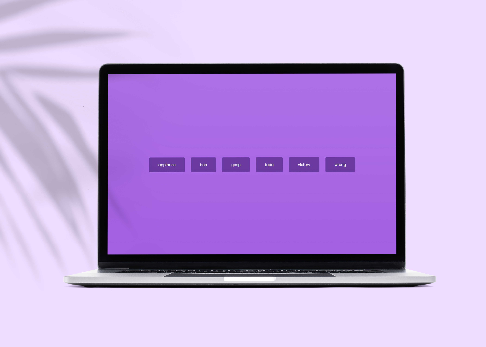

# Input Form Wave Animation 



## 🦉 Main information

Simple sound board built using HTML audio tag and Vanilla Js.

The project goal:
- when a user clicks a button, it makes a sound effect
- if the sound is still playing and a user clicks another one, it's going to stop tha effect and start the next one
- use audio tag methods play and pause 
- set up in HTML, style it with CSS and add the functionality with JavaScript

## 🦊 Useful links to study
```
 https://developer.mozilla.org/en-US/docs/Web/HTML/Element/audio
```

## ⚡ Built With
[HTML5](https://www.w3schools.com/html/) / [CSS3](https://www.w3schools.com/css/) / [JavaScript](https://www.w3schools.com/js/)